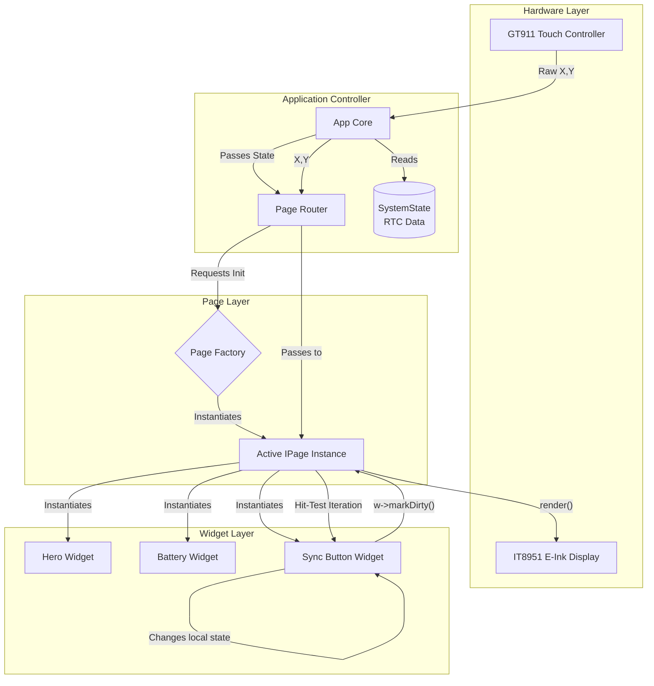

# Page Navigation & Layout Architecture Research

## 1. The Page-Based Paradigm
Following the Widget-based modularity for drawing distinct components, the application must structure these Widgets into logical views, or **Pages**. A Page is a container that handles the lifecycle, memory, data hydration, and coordinate layout of a specific screen (e.g., `TodayPage`, `HourlyForecastPage`, `SettingsPage`).

To ensure scalability, the system needs a central **Page Router** (or Screen Manager) that routes touch inputs, handles transitions, and manages the deep sleep lifecycle.

---

## 2. The Abstract Page Interface

A Page should not just be an array of widgets; it must have a strict lifecycle to handle visibility, memory allocation, and data updates.

### The Contract (`IPage.h`)
```cpp
#ifndef I_PAGE_H
#define I_PAGE_H

#include "Widget.h"
#include "SystemState.h"

class IPage {
public:
    virtual ~IPage() = default;

    // Called once when the page is first allocated
    virtual void init() = 0; 
    
    // Called when the user navigates TO this page
    // Executes a full epd_quality screen clear to wipe ghosting
    virtual void onFocus() = 0; 

    // Called when the user navigates AWAY from this page
    virtual void onBlur() = 0; 

    // Injects the central State struct. Page passes this down to Widgets.
    virtual void updateData(const SystemState& state) = 0;

    // Evaluates _isDirty flags on child widgets and draws them to the screen
    virtual void render() = 0; 

    // Routes X/Y touch coordinates to the appropriate interactive Widget
    virtual bool handleTouch(int16_t x, int16_t y) = 0; 
};

#endif
```

---

## 3. Dynamic Layout Management

Hardcoding X/Y pixel coordinates makes UI changes tedious. Setting up a lightweight layout engine within the Page constructor allows for declarative design.

### A. The Flexible `Box` Concept
Instead of absolute layout, we can use a structured Grid or Stack layout. The Display bounds (540x960) are subdivided logically.

```cpp
// HourlyForecastPage.cpp implementation example

void HourlyForecastPage::init() {
    // 1. Define horizontal constraints
    const int margin = 20;
    const int colWidth = (540 - (margin * 2)) / 4; // 4 columns of data
    
    // 2. Instantiate Widgets allocating them dynamically
    _header = new TextWidget(_gfx, "24-Hour Forecast", margin, 20);
    _widgets.push_back(_header);

    // 3. Declarative Vertical Stacking for array data
    int cursorY = 80;
    for(int i = 0; i < 24; i++) {
        // Create an hourly row widget
        HourlyRowWidget* row = new HourlyRowWidget(
            _gfx, 
            margin, cursorY,       // X, Y
            540 - (margin * 2), 40 // Width, Height
        );
        
        _widgets.push_back(row);
        cursorY += 45; // Step down 45px per row
    }
}
```

### B. Viewports & Scrollable Pages
The M5Paper display is 960px tall, but `HourlyForecastPage` might require 1200px of vertical space. 
*   **The Virtual Canvas:** The Page manages a virtual Y-height.
*   **The Viewport Offset:** Swiping UP/DOWN adjusts a `_scrollY` integer within the Page.
*   **Render Culling:** During `render()`, the Page checks if a Widget's `(Y + Height - scrollY)` intersects with the physical display (`0` to `960`). If the Widget is off-screen, `draw()` is skipped, saving massive amounts of processing time.

---

## 4. The Page Router (Navigation Architecture)

To switch between the `TodayPage`, `TrendsPage`, and `SettingsPage`, a **Page Router** sits at the application core.

### Managing Instantiation & Heap (Deep Sleep Constraints)
If all 5 pages (and their dozens of widgets) are instantiated at once, it risks exhausting the standard SRAM heap. 

*   **Lazy Loading:** The Router should only instantiate the exact Page currently being viewed.
*   **RTC Persistence:** The ID of the currently active page must be stored in `RTC_DATA_ATTR` so that when the ESP32 wakes up every 30 minutes, it doesn't blindly load the Home page, but immediately reloads the page the user left it on.

```cpp
// RTC state persists across deep sleep
RTC_DATA_ATTR uint8_t rtc_active_page_id = 0;

class PageRouter {
private:
    IPage* _activePage = nullptr;
    IDisplayController* _gfx;

public:
    void navigateTo(uint8_t pageId, const SystemState& state) {
        // 1. Teardown old page (freeing heap memory)
        if (_activePage) {
            _activePage->onBlur();
            delete _activePage; 
        }

        // 2. Instantiate new page using a Factory pattern
        rtc_active_page_id = pageId;
        _activePage = PageFactory::createPage(pageId, _gfx);
        
        // 3. Boot new page
        _activePage->init();
        _activePage->updateData(state);
        _activePage->onFocus();   // Triggers screen clear
        _activePage->render();    // Draws widgets
    }

    void handleSwipeLeft() {
        uint8_t next = (rtc_active_page_id + 1) % MAX_PAGES;
        navigateTo(next, *currentState); // Pointers managed externally
    }
};
```

---

## 5. Input Routing Architecture (Touch)

How does a tap on the screen reach a specific button inside a Widget?

1.  **HAL Level:** The GT911 touch hardware triggers the EXT0 wakeup or a background interrupt. `TouchDriver` reads pure coordinates: `X=150, Y=300`.
2.  **Router Level:** The `AppController` passes these coordinates to `PageRouter::handleTouch(150, 300)`.
3.  **Page Level:** The Active Page loops through its `_widgets` array. It performs a **hit-test** check:
    ```cpp
    bool Page::handleTouch(int x, int y) {
        for (Widget* w : _widgets) {
            if (x >= w->getX() && x <= w->getX() + w->getWidth() &&
                y >= w->getY() && y <= w->getY() + w->getHeight()) {
                
                // Hit! Route event to this widget.
                if (w->onClick()) {
                    w->markDirty();
                    return true; // Input absorbed
                }
            }
        }
        return false;
    }
    ```

---

## 6. End-to-End Architectural Diagram

This flow tracks how Data, Pages, and Hardware interact conceptually.

