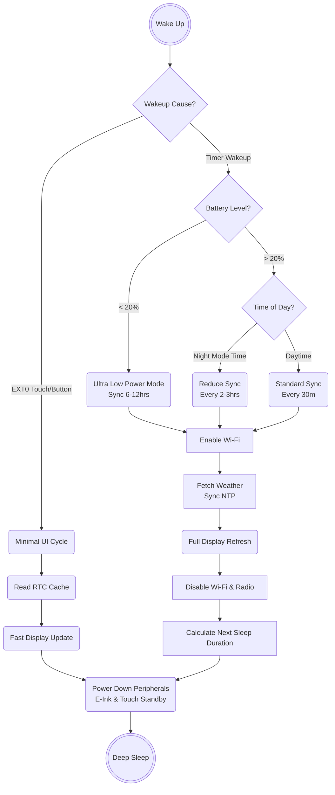
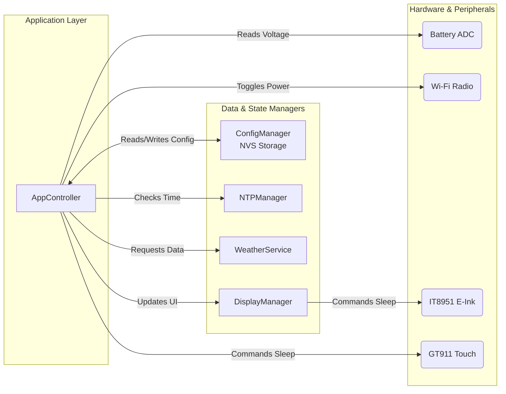

# Power Management & Sync Frequency Research

## 1. Overview and Current State

The M5Paper Weather Monitor relies heavily on the ESP32's **Deep Sleep** capability to maximize battery life, operating functionally as an event-driven state machine (where `setup()` handles the logic and `loop()` is unused). Currently, the device wakes up, connects to Wi-Fi, fetches weather data, updates the e-ink display, and goes back to sleep for a fixed duration (typically 30 minutes).

To further extend battery life and improve the user experience, we can introduce **Adaptive Polling (Dynamic Call-in Frequency)** and stricter peripheral power management.

---

## 2. Advanced Power State Management

### A. Peripheral Power-Down Sequencing

Before entering deep sleep, it is critical to ensure all peripherals are completely powered down to prevent phantom current draw.

1. **Wi-Fi & Radio**: Explicitly turn off the radio.

   ```cpp
   WiFi.disconnect(true);
   WiFi.mode(WIFI_OFF);
   ```

2. **E-Ink Display (IT8951)**: The M5Paper's display controller consumes significant power if left in standby. Ensure the display is put into its deepest sleep state using M5GFX sleep commands before EPS32 sleep.
3. **I2C / Touch Panel**: The GT911 touch IC should be put into sleep mode.

### B. Smart Wakeup Handling (EXT0 vs. Timer)

The ESP32 can wake up via different triggers. The firmware must immediately identify the wakeup reason (`esp_sleep_get_wakeup_cause()`) to avoid unnecessary battery drain:

* **Timer Wakeup (Regular Sync)**: Full cycle -> Enable Wi-Fi, fetch data, update display, sleep.
* **EXT0 Wakeup (Button Press / Touch)**: Minimal cycle -> Do **NOT** enable Wi-Fi. Read the requested UI page from `RTC_DATA_ATTR` buffers, render the local data to the e-ink display, and immediately return to deep sleep.
* **Hardware Constraint Reminder**: For the G37/G38/G39 rocker switch, `rtc_gpio_init()` and `rtc_gpio_set_direction(..., RTC_GPIO_MODE_INPUT_ONLY)` must be called before enabling EXT0, without internal pull-ups.

---

## 3. Dynamic Call-In Frequency (Adaptive Polling)

Instead of a hardcoded 30-minute interval, the device should scale its sync frequency based on environmental and hardware contexts.

### A. Battery-Aware Stepping

If the battery drops below critical thresholds, the device should automatically reduce its network activity (the most power-hungry operation).

* **> 50% Battery**: Sync every 30 minutes (Default).
* **20% - 50% Battery**: Sync every 1 to 2 hours.
* **< 20% Battery**: Enter "Ultra Low Power" mode. Sync every 6 hours, or only sync when the user manually forces it via the rocker switch. Show a low-battery icon on the display.

*Note: Raw battery voltage is read via `analogReadMilliVolts(35) * 2`.*

### B. Time-of-Day Context (Night Mode)

Weather parameters change less frequently at night, and the user is unlikely to look at the screen.

* **Daytime (e.g., 06:00 - 22:00)**: Normal sync interval.
* **Nighttime (e.g., 22:00 - 06:00)**: Reduce sync interval to every 2 or 3 hours.
* This logic can be determined locally using the NTP-synced RTC time before calculating the next `esp_sleep_enable_timer_wakeup()` duration.

---

## 4. User-Configurable Settings

Users should be able to dictate the baseline behavior of the device.

### Captive Portal Additions

Add a "Power & Sync" section to the new Captive Portal SPA:

1. **Base Sync Interval**: Dropdown containing [15 mins, 30 mins, 1 hour, 3 hours, 6 hours].
2. **Enable Night Mode**: Checkbox to reduce syncs overnight.
3. **Night Mode Hours**: From [HH:MM] to [HH:MM].

### NVS Storage (`ConfigManager`)

These settings must be serialized into the ESP32's Non-Volatile Storage (NVS) via `Preferences.h`.

```cpp
// Example schema for ConfigManager
struct PowerConfig {
    uint16_t baseSyncIntervalMins = 30;
    bool enableNightMode = true;
    uint8_t nightModeStartHour = 22;
    uint8_t nightModeEndHour = 6;
};
```

---

## 5. Architectural Implementation Guide

To implement this cleanly within the existing Singleton architecture:

1. **`ConfigManager` Update**: Add getter/setter methods for the new `PowerConfig` structs and ensure they are exposed to the `WebServer` during Captive Portal setup.
2. **`AppController` Logic Change**:
    * Centralize the sleep calculation into a new private method: `uint64_t calculateNextWakeupUs()`.
    * This method will read the current time from `NTPManager`, the battery voltage, and the user settings from `ConfigManager` to determine if it should sleep for 30 minutes, 2 hours, or until morning.
3. **Force Sync**: When the user requests an immediate weather update via the UI, use `_enterDeepSleepForImmediateWakeup()` (1-second timer) to bypass the adaptive schedule, rebooting cleanly into a full Timer Wakeup cycle.

---

## 6. System Diagrams

### Power State & Wakeup Flowchart
The following flowchart visualizes the decision tree the ESP32 follows upon waking up from deep sleep, distinguishing between short intervals, standard fetches, and user interactions.



### Adaptive Polling Architecture
This diagram illustrates the separation of concerns between the core application controller and the managers responsible for power and state.


