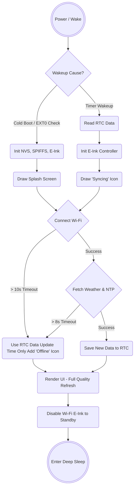

# Startup Sequence Optimization & Polish Research

## 1. Overview & Objectives

A device's startup sequence defines the first impression of its reliability. On ESP32 e-ink devices, poor startup management often leads to visual glaring (unnecessary full-screen flashes), "frozen" states if Wi-Fi drops, and excessive battery drain.

The goal of this research is to define a startup sequence that:

1. **Looks Polished:** Provides immediate visual feedback without destroying the lingering e-ink image prematurely.
2. **Is Bug-Resistant:** Prevents hanging on network calls and introduces graceful degradation.
3. **Respects Boot Types:** Differentiates between a Cold Boot (power on) vs. a Warm Boot (waking up from deep sleep).

---

## 2. Boot Contexts & Visual Strategies

E-ink screens retain their physical image while powered off. We can leverage this to create a seamless transition.

### A. Cold Boot (Power On / Reset)

* **Hardware State:** No RTC memory available, no previous screen state known.
* **Visual Strategy:** Immediate Full-Screen Logo/Splash.
* **Action:** Flash the screen to wipe artifacts, draw a centered branding logo, then display a stepped progress bar (`[■■■□□]`) as systems initialize.

### B. Warm Boot (Timer Wakeup from Deep Sleep)

* **Hardware State:** `RTC_DATA_ATTR` buffers contain the last known weather data. Display already shows the previous UI.
* **Visual Strategy:** Non-intrusive "Syncing" toast or corner icon.
* **Action:** **DO NOT** clear the screen initially. Render a small "Syncing..." text or icon in the corner using `epd_fastest`. This reassures the user it is working without blinding them with a 2-second flash.

---

## 3. Resiliency & Bug Prevention (Failsafes)

To prevent the device from hanging and draining the 1150mAh battery in a few hours, strict constraints must be enforced during the networking phase.

### A. Defensive Timeouts

The biggest source of startup bugs is infinite blocking loops (`while (WiFi.status() != WL_CONNECTED)`).

* **Wi-Fi Timeout:** Max 10 seconds. If it fails, abort, render a "No Wi-Fi" icon on top of the old RTC data, and go back to sleep.
* **API Timeout:** Max 8 seconds. Cloud APIs can hang. Use the HTTP Client timeout settings.
* **Hardware Watchdog (WDT):** Enable the ESP32 Task Watchdog Timer. Set it to 30 seconds. If the device ever stays awake for longer than 30 seconds without sleeping, the WDT will reset the chip.

### B. Fallback to RTC Cache (Graceful Degradation)

If the device wakes up but cannot fetch new data (server down, router rebooting):

1. Catch the failure gracefully.
2. Read the `RTC_DATA_ATTR WeatherData` cache.
3. Update ONLY the local clock time (the RTC timer still advances during sleep).
4. Render an "Offline" or "Cached" icon next to the time timestamp so the user knows the data is stale, rather than displaying an ugly `NULL` or Error page.
5. Go back to deep sleep and try again in 30 minutes.

---

## 4. The Ideal Boot Sequence

Here is the exact order of operations to ensure hardware stability and visual polish:

1. **Boot & Identify:** Wake up. Call `esp_sleep_get_wakeup_cause()`.
2. **Core Init:** Initialize NVS (`ConfigManager`) and E-Ink controller (`DisplayManager`) synchronously.
3. **Initial UI Feedback:**
    * *If Cold Boot:* Draw Splash Screen (`epd_quality`).
    * *If Warm Boot:* Draw small "Sync" icon over existing UI (`epd_fastest`).
4. **Network Phase:** Start Wi-Fi. (Async or bounded loop with timeout).
5. **Fetch Phase:** NTP Time Sync $\rightarrow$ Weather API Fetch.
6. **Render Phase:** Push the newly formatted data payload to the `DisplayManager`.
    * Execute a single `epd_quality` screen update bridging the old image to the new image.
7. **Power Down Phase:** Turn off Wi-Fi $\rightarrow$ Sleep E-ink $\rightarrow$ Calculate Sleep Time $\rightarrow$ ESP Deep Sleep.

---

## 5. Startup Architecture Flowchart

